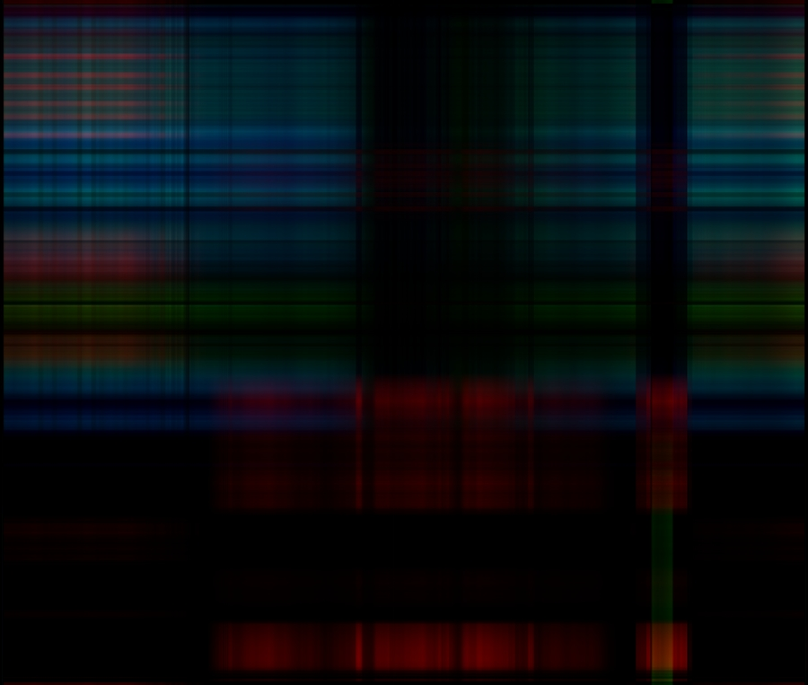

```{r setup, include=FALSE}
set.seed(213)

library(dplyr)
library(ggplot2)

knitr::opts_chunk$set(echo = TRUE, warning = FALSE)
```


# Oryginalny obrazek

W tej pracy zajmę się kompresją poniższego obrazka z użyciem PCA.


Rozmiar oryginalnego pliku w kB wynosi:
```{r}
(original_filesize <- file.size("original.jpeg") / 1000)
```


# Wczytanie

Wczytuję obrazek korzystając z biblioteki `jpeg`. Rozdzielam obrazek na warstwy RGB, każdą z nich będę kompresował oddzielnie.

```{r}
image <- jpeg::readJPEG("original.jpeg")

r <- image[, , 1]
g <- image[, , 2]
b <- image[, , 3]
```


# Kompresja

Dokonuję PCA używając funkcji `prcomp`:

```{r}
pca_r <- prcomp(r)
pca_g <- prcomp(g)
pca_b <- prcomp(b)
```

Poniższa funkcja kompresuje obrazek używając wskazanej liczby składowych `comp` i zapisuje o jako jpeg. Zwraca informację o rozmiarze pliku skompresowanego obrazka.

```{r}
compress_and_save <- function(r, g, b, comps) {
  r1 <- r$x[, 1:comps] %*% t(r$rotation[, 1:comps])
  g1 <- g$x[, 1:comps] %*% t(g$rotation[, 1:comps])
  b1 <- b$x[, 1:comps] %*% t(b$rotation[, 1:comps])
  compressed <- array(c(r1, g1, b1), dim = c(rev(dim(r$rotation)), 3))

  savepath <- paste0("compressed/compressed_", comps, "PCs.jpeg")
  
  jpeg::writeJPEG(compressed, savepath, quality = 1)
  
  compressed_filesize <- file.size(savepath) / 1000
  
  return(data.frame(Liczba.skladowych = comps, Rozmiar.pliku.w.kB = compressed_filesize))
}
```

# Porównanie kompresji z wykorzystaniem różnej liczby składowych

## 1 składowa

```{r}
sizes <- compress_and_save(pca_r, pca_g, pca_b, 1)
```




## 4 składowe

```{r}
sizes <- sizes %>% rbind(compress_and_save(pca_r, pca_g, pca_b, 4))
```


## 8 składowych

```{r}
sizes <- sizes %>% rbind(compress_and_save(pca_r, pca_g, pca_b, 8))
```


## 16 składowych

```{r}
sizes <- sizes %>% rbind(compress_and_save(pca_r, pca_g, pca_b, 16))
```


## 64 składowe

```{r}
sizes <- sizes %>% rbind(compress_and_save(pca_r, pca_g, pca_b, 64))
```


## 256 składowych

```{r}
sizes <- sizes %>% rbind(compress_and_save(pca_r, pca_g, pca_b, 256))
```


## 512 składowych

```{r}
sizes <- sizes %>% rbind(compress_and_save(pca_r, pca_g, pca_b, 512))
```


## 763 składowe - oryginalny rozmiar obrazka

```{r}
sizes <- sizes %>% rbind(compress_and_save(pca_r, pca_g, pca_b, 763))
```


# Porównanie rozmiarów plików

```{r}
sizes %>% 
  ggplot(aes(x = Liczba.skladowych, y = Rozmiar.pliku.w.kB)) +
  geom_point() + 
  geom_hline(yintercept = 221.5, linetype = "dashed", color = "red") +
  labs(title = "Zależność rozmiaru pliku od liczby głównych składowych użytych do kompresji", 
       subtitle = "Pozioma linia reprezentuje oryginalny rozmiar obrazka") +
  ylim(0, 500)
```

Kompresja za pomocą PCA okazuje się w tym przypadku bezsensowna. Mimo, że teoretycznie powinnismy zyskać na rozmiarze danych, to w praktyce po zapisie pliku w formacie JPEG jego rozmiar przekracza oryginalny już przy użyciu 4 składowych.

